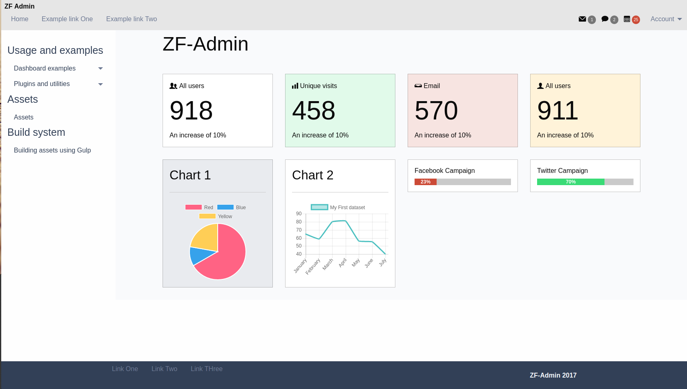

# zf-admin
 ZF-Admin is a simple starter template for building admin interfaces.

## Motivation
I wanted a Zurb Foundation based template with just a minimum amount of features and a proper build system.

## Features
* Plugins: Datepickers, graphs, notifications e.t.c
* Asset managememt using <a href="https://bower.io/">Bower</a>
* Build system using <a href="http://gulpjs.com/">Gulp</a></li>
* Templating system using <a href="https://github.com/codepb/jquery-template"> Jquery.loadTemplate</a></li>

These features can be configured and are not mandatory.

  Check out the example folder in the repository to see the plug-ins in use. Comment out the plug-ins you don't need to streamline your assets.

## Using the admin template with the dev/ build system
1. Run "npm install"
2. Run "bower install"

## Using the admin template with default dependencies.
1. Run "bower install"
